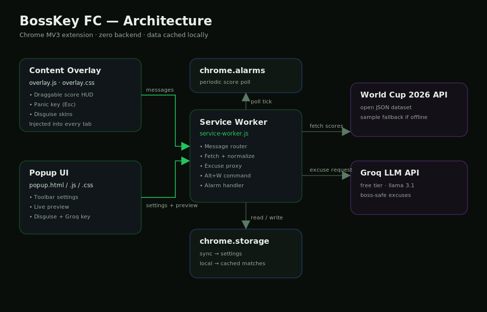

# BossKey FC ⚽

**Watch the World Cup 2026 at work — without looking like you're watching the World Cup.**

BossKey FC is a Chrome extension that puts a small, draggable live‑score widget on
any page. It can disguise itself as a spreadsheet, Slack, or Jira, hides instantly
when you hit the panic key, and can even write you a "boss‑safe" message that quietly
describes what just happened in the match.

No servers, no sign‑up, no cost. Everything runs in your browser.

---

## Architecture



At a glance:

- **Content overlay** is injected into every tab and draws the score HUD.
- **Service worker** is the hub: it fetches scores, caches them, and talks to the APIs.
- **Popup** is the control panel for settings and a live preview.
- **chrome.storage** keeps your settings (synced) and the latest scores (local).
- **chrome.alarms** ticks on a timer so scores refresh in the background.
- Two **external APIs**: an open World Cup 2026 dataset for scores, and Groq for excuses.

---

## Features

| Feature | What it does |
| --- | --- |
| 🟢 Live score HUD | Small floating widget with current scores, status and minute |
| 🎭 Disguise skins | Make the widget look like Google Sheets, Slack, or Jira |
| 🆘 Panic key | Press **Esc** to make the overlay vanish instantly |
| ⌨️ Quick toggle | Press **Alt+W** to show or hide the overlay anywhere |
| 🧲 Draggable | Move the widget anywhere; its position is remembered |
| 🗣️ Boss‑safe excuses | Generate an office‑sounding message that secretly encodes a match moment |
| 🙈 Meeting‑safe | Auto‑disabled on Google Meet, Zoom and Microsoft Teams |
| 🔌 Offline‑friendly | Falls back to sample matches if the live feed is unreachable |

---

## How it works

1. The **service worker** polls a scores endpoint on a timer (`chrome.alarms`) and
   stores the latest matches in `chrome.storage.local`.
2. The **overlay** asks the worker for those matches and renders the HUD. It refreshes
   on its own interval while visible.
3. The **popup** reads and writes your settings to `chrome.storage.sync`, so they
   follow you across machines.
4. When you ask for an excuse, the worker sends the current match context to the
   **Groq** API and returns a short, innocent‑sounding work message.

---

## Install (developer mode)

1. Clone or download this repository.
2. Open `chrome://extensions` in Chrome.
3. Turn on **Developer mode** (top‑right).
4. Click **Load unpacked** and select the project folder.
5. Pin **BossKey FC** to your toolbar and open the popup to configure it.

> No Chrome Web Store account or build step is required.

---

## Settings

Open the popup (toolbar icon), then use the **Settings** tab to control:

- **Enable overlay** — master on/off switch.
- **Disguise** — Off, Sheets, Slack, or Jira.
- **Favorite team** — used to highlight matches you care about.
- **Poll every (min)** — how often scores refresh.
- **Scores endpoint** — leave blank for the default open dataset, or point it at your own.
- **Groq API key** — saved in Chrome sync storage and required only for the excuse generator ([get a free key](https://console.groq.com)).

---

## Keyboard shortcuts

| Shortcut | Action |
| --- | --- |
| `Alt + W` | Toggle the overlay |
| `Esc` | Panic — hide immediately |

---

## Project structure

```
BossKey-FC/
├── manifest.json              # MV3 manifest
├── icons/                     # Generated PNG icons (16/48/128)
├── docs/
│   ├── architecture.svg       # Source diagram
│   └── architecture.png       # Rendered diagram (used in this README)
├── scripts/
│   └── generate_icons.py      # Re-generates the icons
└── src/
    ├── shared/config.js       # Constants shared by worker + content + popup
    ├── background/
    │   └── service-worker.js  # Polling, caching, messaging, Groq proxy
    ├── content/
    │   ├── overlay.js         # Draggable HUD + panic/toggle behaviour
    │   └── overlay.css        # HUD styling + disguise skins
    └── popup/
        ├── popup.html
        ├── popup.js
        └── popup.css
```

---

## Tech stack

- **Chrome Manifest V3** — service worker, content scripts, commands.
- **Vanilla JavaScript / HTML / CSS** — no framework, no bundler.
- **Open World Cup 2026 dataset** — live scores (with a built‑in sample fallback).
- **Groq (free tier, Llama 3.1)** — generates the boss‑safe excuses.

---

## Development

Regenerate the icons after editing the generator:

```bash
python3 scripts/generate_icons.py
```

Re‑render the architecture diagram after editing the SVG:

```bash
python3 -c "import cairosvg; cairosvg.svg2png(url='docs/architecture.svg', write_to='docs/architecture.png', output_width=1000, output_height=640)"
```

---

## Disclaimer

BossKey FC is a personal, for‑fun project. Use it responsibly and follow your
workplace's policies. The excuse generator is a novelty — you're responsible for
anything you send.
